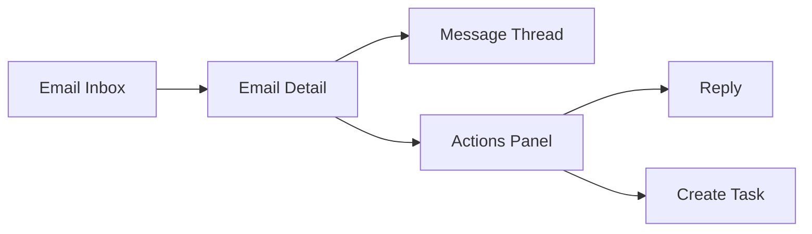

---

# 📄 `modules/email/README.md`

```md
# Email Module

## What it does

Displays conversations, allows replies, and generates task suggestions from messages.

```

---

## Workflow

```mermaid
flowchart TD
    A[Incoming Email] --> B[Display Thread]
    B --> C[User Reviews Message]
    C --> D[AI Suggests Task (optional)]
    D --> E[User Clicks Create Task]
    E --> F[Navigate to Tasks Module]
```

---

## UI Mapping



---

## Purpose

```
Handles communication and acts as the primary input layer for task creation.

```

---

## Notes

* Task creation uses prefill navigation (Email → Tasks)
* Supports fallback if no AI suggestion exists
* Designed for human-in-the-loop workflows

````

