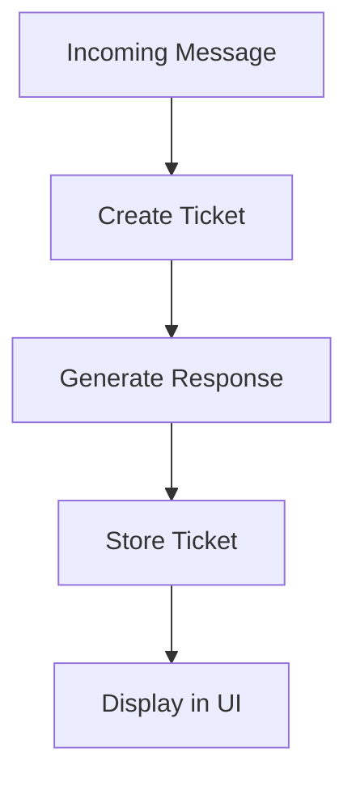

---

# 📄 `modules/intake/README.md` 

````md
# Intake Module

## What it does

Turns incoming messages into tracked tickets with an automatic response.

````
---

## Workflow



---

## UI Mapping

```mermaid
flowchart LR
    Inbox[Inbox Panel] --> Detail[Ticket Detail]

    Detail --> Inbound[Inbound Message (Left)]
    Detail --> Outbound[Outbound Message (Right)]
```

---

## Purpose

```
Entry point for all external input into the system.

```
random
   test
