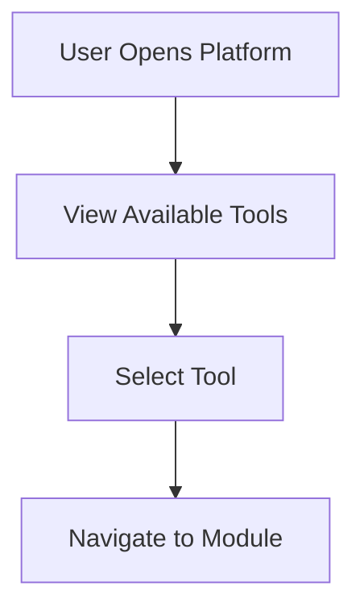
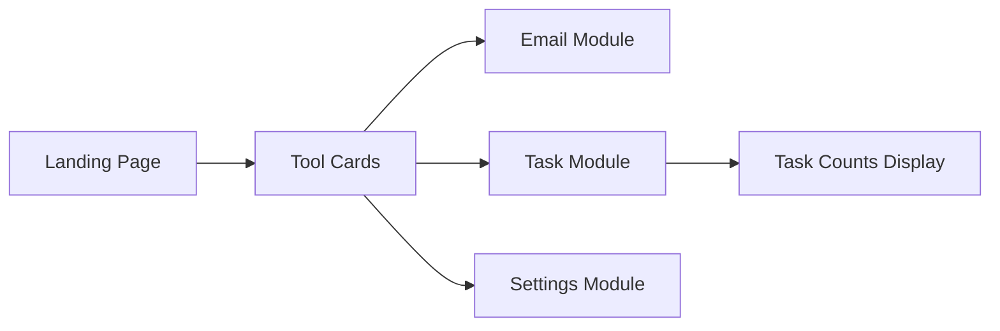

---

# 📄 `modules/platform/README.md`

```md
# Platform Module

## What it does

Provides navigation and a high-level overview of available tools.

````

---

## Workflow



---

## UI Mapping



---

## Purpose

```
Central hub for navigating between modules and providing quick system insights.

```

---

## Notes

* Displays task counts:

  * open
  * inProgress
  * done
* Acts as lightweight dashboard
* Designed for scalability as more tools are added

````
