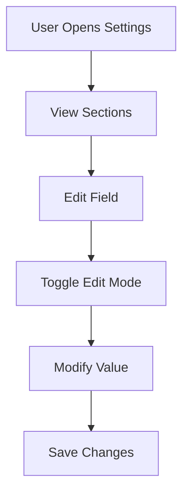
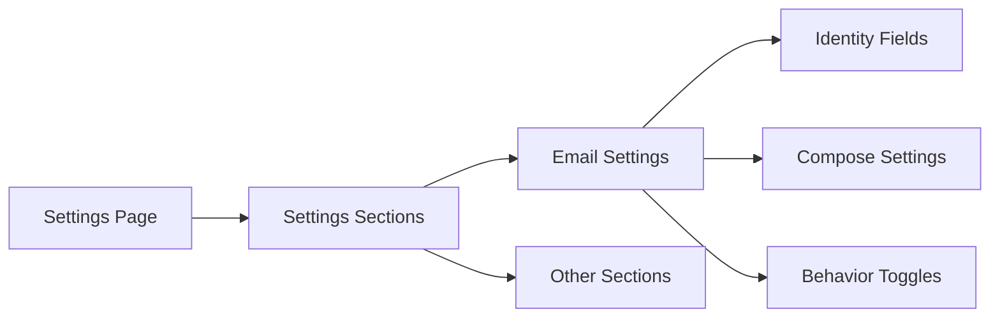

---

# 📄 `modules/settings/README.md`

```md
# Settings Module

## What it does

Manages user preferences and configuration across all modules.

```

---

## Workflow



---

## UI Mapping



---

## Sectional Structure

```text
Settings
  ├── Email
  │     ├── Identity
  │     │     - Name
  │     │     - Reply Email
  │     │
  │     ├── Compose
  │     │     - Signature
  │     │     - Auto-append signature (future)
  │     │
  │     ├── Behavior
  │     │     - Send on Enter (future)
  │     │     - AI task suggestions (future)
  │
  ├── Tasks (future)
  │     - Default status behavior
  │     - Notifications
  │
  ├── AI (future)
  │     - Prompt tuning
  │     - Response style
```

---

## Purpose

```text
Centralized configuration layer that controls behavior across modules.

```

---

## Notes

* Uses display-first UI (read-only → edit mode)
* Edits are staged and require Save/Cancel
* Designed for modular expansion (section-based)
* Email settings will directly influence:

  * reply composition
  * signature injection
  * AI-assisted actions

```
```
