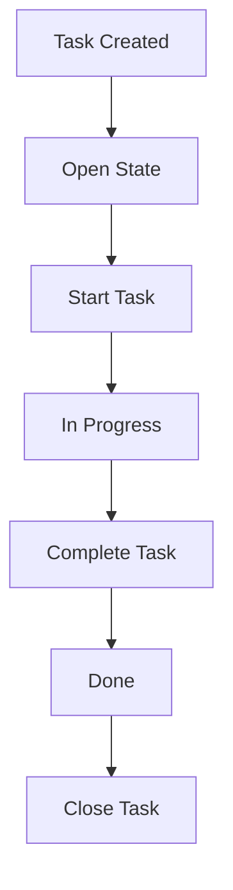
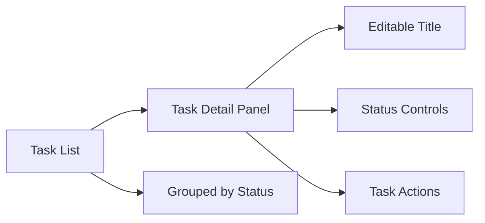

---

# 📄 `modules/tasks/README.md`

```md
# Tasks Module

## What it does

Tracks, organizes, and manages all work items generated by the system.

````

---

## Workflow



---

## UI Mapping



---

## Purpose

```
Acts as the system of record for all actionable work.

```

---

## Notes

* Global state managed via TaskContext
* Tasks are grouped by status:

  * open
  * inProgress
  * done
  * closed
* Updates are immediate (no save required)
* New tasks are auto-selected upon creation

````